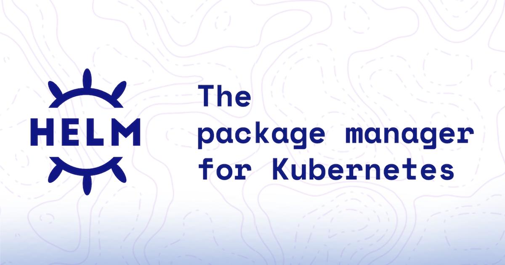

# Helm

**Helm** — пакетный менеджер для **Kubernetes**: **charts** (шаблоны + значения), **releases** в кластере, **репозитории** с версиями. **Helm v3** работает без **Tiller**, применяя манифесты через **Kubernetes API**.
## Материалы

- [**1. Основы**](topic-1-basics.md) — что такое Helm, Chart/Release/Repository, структура чарта (`Chart.yaml`, `values.yaml`, `templates/`), команды `create`/`install`/`upgrade`/`uninstall`, `helm template`, практики для production.
- [**2. Шаблоны Helm**](topic-2-templates.md) — `.Values`, `if`/`range`, `default`/`required`, `toYaml`/`nindent`, пайплайны; примеры Deployment, Service, Ingress и настраиваемые replicas/image/resources.
- [**3. Работа с values**](topic-3-values.md) — приоритет `values.yaml`, `-f`, `--set`/`--set-string`; dev/stage/prod; примеры `values-dev.yaml` и `values-prod.yaml`, команды `helm template`/`upgrade`.
- [**4. Lifecycle и управление релизами**](topic-4-lifecycle-releases.md) — `list`/`history`/`rollback`, как устроен upgrade и rollback, `--atomic`/`--wait`/`--timeout`, `helm get`, production checklist.
- [**5. Отладка Helm**](topic-5-debugging.md) — `helm template`, `helm lint`, `install`/`upgrade` с `--dry-run` и `--debug`, пайп в `kubectl apply --dry-run=server`, типовые ошибки и лабораторные поломки.
- [**6. Зависимости чартов**](topic-6-dependencies.md) — `dependencies` в `Chart.yaml`, `helm dependency update`/`build`, `Chart.lock`, values для subchart’ов; пример Redis и Ingress NGINX, практики production.
- [**7. Лучшие практики чартов**](topic-7-best-practices.md) — именование, лейблы и аннотации, `_helpers.tpl`, `define`/`include`, DRY; пример `fullname` и общих лейблов.
- [**8. Секреты и безопасность**](topic-8-secrets-security.md) — почему не plain Secrets в values/Git; Sealed Secrets, SOPS и `helm-secrets`, Vault/External Secrets; практика безопасного деплоя.
- [**9. Helm и CI/CD**](topic-9-helm-cicd.md) — GitLab CI и GitHub Actions: lint, `helm template`, деплой `helm upgrade --install`; примеры pipeline, OIDC, checklist.
- [**10. Helm в production**](topic-10-production.md) — semver чарта и `appVersion`, обратная совместимость values, zero-downtime (RollingUpdate, пробы, PDB), canary/blue-green через K8s; практика upgrade/rollback.
- [**11. Helm и GitOps**](topic-11-helm-vs-gitops.md) — чем push-Helm не GitOps; Helm в **Argo CD** и **Flux** (`Application`, `HelmRelease`); единый источник истины, ссылка на материал Argo CD.

